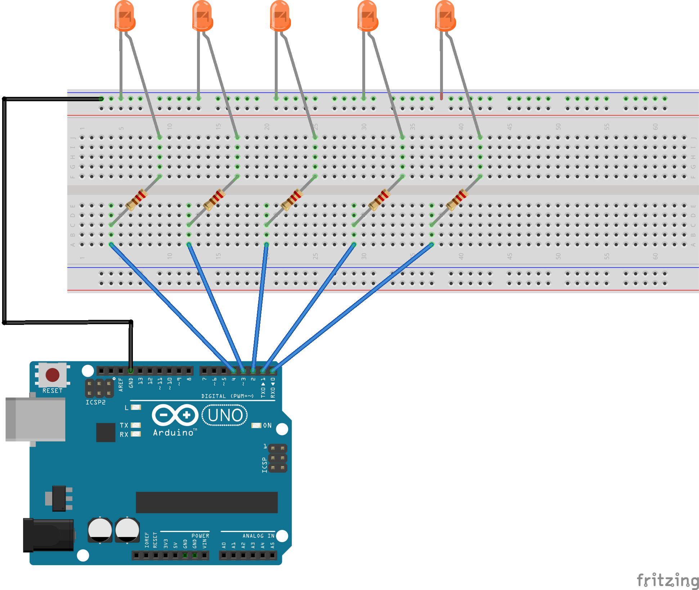

## Marquesina de 5 LEDs

La idea es que un led se encienda durante un intervalo de tiempo. Una vez pasado el tiempo se apagara y el siguiente hará lo mismo, consiguiendo un efecto de movimiento.

 

###Montaje:
--
El diagrama del circuito es el siguiente:

Como todavía no me entero mucho con el tema de las resistencias, he utilizado unas de **1k Ohms**. Para identificarlas, estos serian sus colores:

MARRON | NEGRO | ROJO |     | ORO |
-------|-------|------|-----|-----|

 

### Código:
--
~~~
int led0 = 0;
int led1 = 1;
int led2 = 2;
int led3 = 3;
int led4 = 4;

void setup(){
  pinMode(led0, OUTPUT);
  pinMode(led1, OUTPUT);
  pinMode(led2, OUTPUT);
  pinMode(led3, OUTPUT);
  pinMode(led4, OUTPUT);
}

void loop() {
 delay(100);
 digitalWrite (led0, HIGH);
 delay(500);
 digitalWrite (led0, LOW); 
 digitalWrite (led1, HIGH);
 delay(500);
 digitalWrite (led1, LOW); 
 digitalWrite (led2, HIGH);
 delay(500);
 digitalWrite (led2, LOW);
 digitalWrite (led3, HIGH);
 delay(500);
 digitalWrite (led3, LOW);
 digitalWrite (led4, HIGH);
 delay(500);
 digitalWrite (led4, LOW);
} 
~~~

