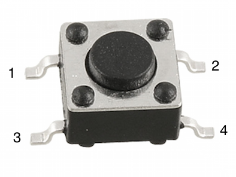
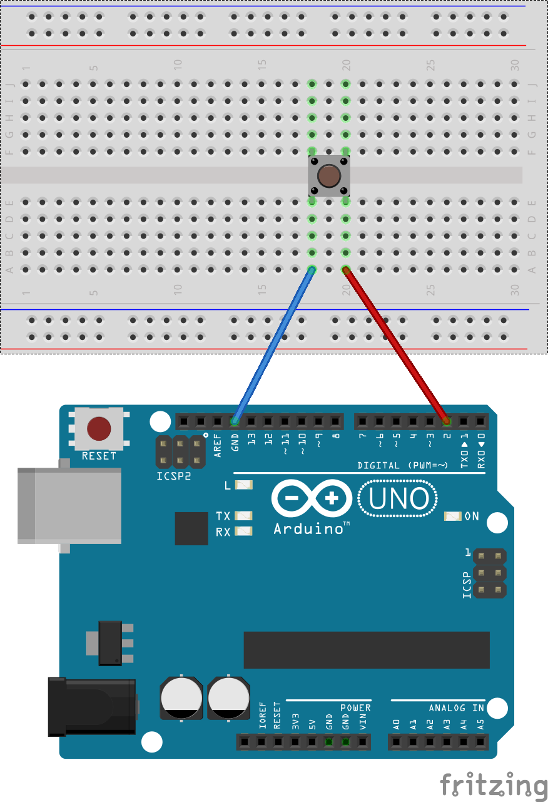

## Interruptor

Lo Interruptores son una manera simple y directa de interactuar. Los mas comunes y baratos son como los de la siguiente imagen:

Tiene 4 pines y están divididos en 2 partes: por un lado tiene los pines 1 y 2 que en realidad son los extremos de un mismo trozo de metal, y por el otro los pines 3 y 4, que a su vez también son un mismo trozo de metal. Cuando pulsamos interruptor lo que hacemos es crear un contacto entre los  trozos de metal que componen los pines 1 y 2 con el de los pines 3 y 4.

###Montaje
--
Lo que vamos  a montar es un simple interruptor que estará conectado a un pin del Arduino en modo INPUT. de esta manera cuando lo pulsemos el circuito se cerrara. Para ver que realmente el pulsador esta funcionando, crearemos una conexión **serial** entre el ordenador y el Arduino que nos devolverá un 1 (TRUE) o 0 (FALSE) indicando si el circuito esta cerrado o no.

###Código
--
Una vez compilado el código y grabado en el Arduino, vamos a **Herramientas** y después le damos a **Monitor Serial**. Se abrirá una nueva ventana con la señal que llega del Arduino. Pulsando el interruptor se vera cono el valor cambia de 0 a 1 en el **Monitor Serial**.

~~~
int boton = 2;

void setup ()
{
 Serial.begin(9600); 
 pinMode(boton, INPUT_PULLUP);
}

void loop()
{
  int valor = digitalRead(boton);
  Serial.println(valor, DEC);
}
~~~
