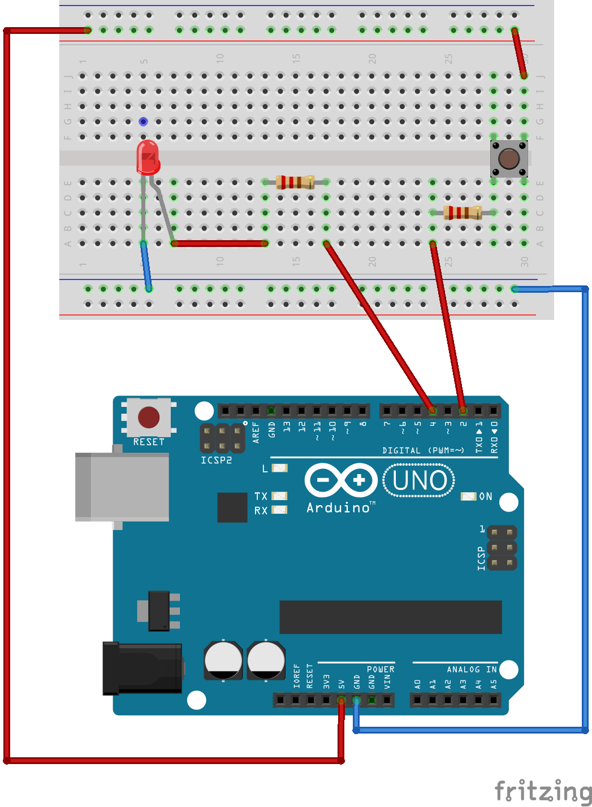

## Encender un LED mediante un Pulsador

Con este proyecto uniremos lo aprendido con los botones y los led. La idea es la siguiente: 

Leeremos el estado del un pulsador, en caso de que este pulsado indicaremos al Arduino que encienda el led.

 

###Montaje
--
El diagrama del circuito es el siguiente:

Como todavía no me entero mucho con el tema de las resistencias, he utilizado unas de **1k Ohms**. Para identificarlas, estos serian sus colores:

MARRON | NEGRO | ROJO |     | ORO |
-------|-------|------|-----|-----|

 

### Código:
--
~~~
int boton = 2;
int led = 13;

void setup ()
{
  pinMode(boton, INPUT_PULLUP);
  pinMode(led, OUTPUT);
}

void loop()
{
 int valor = digitalRead(boton);
 if (valor == HIGH)
 {
   digitalWrite(led, LOW);
 }
 else
 {
   digitalWrite(led, HIGH);
 } 
 
}
~~~