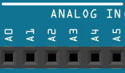
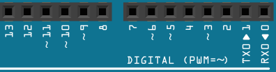
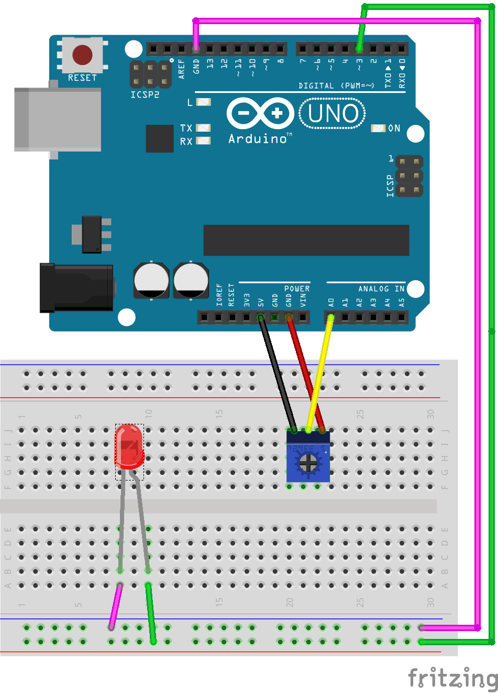

## Entradas Analógicas

El Arduino al ser un dispositivo **digital** no es capaz de trabajar con valores analógicos, por lo que hace una especie de conversion para tratar estos valores.

Los pines digitales pueden tener 2 valores: 1 que significa que pasaran 5v/3,3v y 0 que nos indica que no esta pasando ninguna corriente por ese pin, 0v.  

En los analógicos en cambio, estos valores pueden ser asta 1024: el valor 1024 significa que están pasando 5v/3,3V y 0 que pasan 0v, es decir, nada. El resto de valores entre 1024 y 0 serán interpretados por Arduino según el voltaje que vaya pasando, por ejemplo, a groso modo, si **5V=1024** y **0v=0**, **512 seria 2,5v** la mitad de 5v.

El Arduino tiene 6 puertos analógicos, todos ellos son de entrada por lo que no tendremos que declararlos a la hora de programar el Arduino, solamente con mencionar el puesto sera suficiente A0, A1, A2...

Para simular una salida analógica Arduino utiliza varios puertos digitales. No todos, solo aquellos con el signo **"~"**. Seria de suponer que estos pudiesen soportar los mismos 1024 valores de los pines de entrada, pero estos en cambio solo soportan 255, es decir, 255=5v y 0=0v.

Para juguetear con los valores analógicos utilizare un **Potenciómetro**. Lo que conseguiremos con este dispositivo, es cambiar el voltaje a nuestro antojo girando la ruletilla que tiene. Como se puede ver en la imagen superior tiene 3 pines, en los laterales tenemos que conectar 5V a uno y GND al otro. Y en el del centro saldrá el voltaje depuse de haber sido manipulado por nosotros una vez giremos la ruletilla. 

## Montaje

Como se puede ver en la imagen utilizaremos un led y un potenciómetro:

Con el potenciómetro cambiaremos los 5V a nuestro antojo y los redirecionaremos a un puerto analógico. Arduino tomara este valor analógico y portara a un puerto PWM donde esta conectado un led. por lo que girando la ruletilla del potenciómetro podremos aumentar o disminuir la intensidad de la luz del led.

## Código

~~~

int ledPin = 3;

void setup()
{                                                                                                                                                                                                                                                                              
  pinMode(ledPin, OUTPUT);
}

void loop()
{
  int valor_analog = analogRead(A0);
  int valor_luz = int((float(valor_analog) * 255.0) / 1023.0);
  analogWrite(ledPin, valor_luz);
}
~~~
