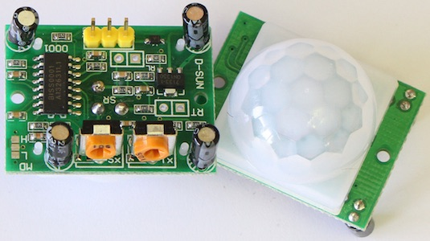
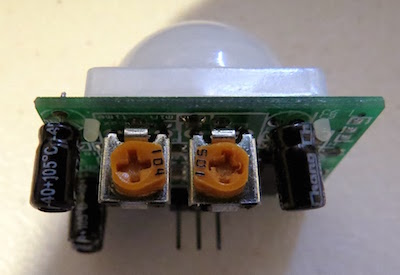
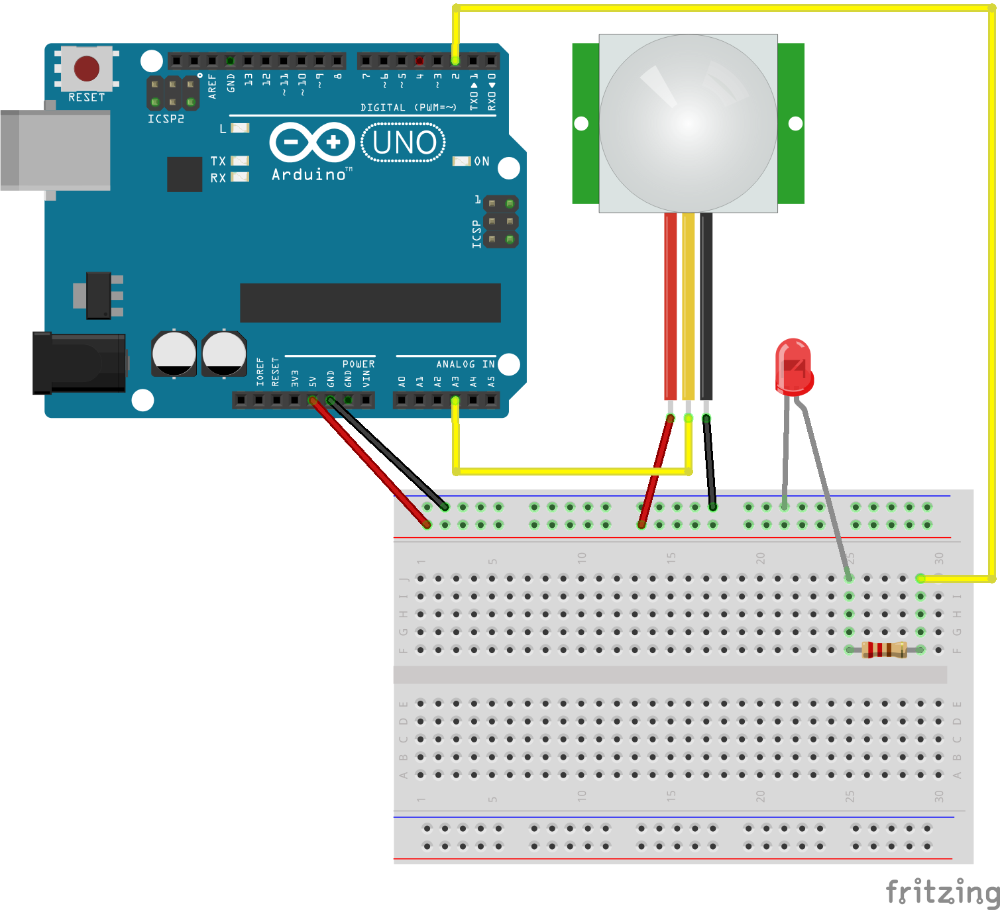

## Sensor de Movimiento HC-SR501

El sensor **HC-SR501** es un detector de movimiento, detecta cambio en los niveles de radiación de infrarrojos. El sensor esta dividido por la mitad, cuando detecta un cambio en el nivel de infrarrojos entre las dos mitades envía una señal por el pin de salida.

En la parte trasera tiene 3 pines por los que los pasaremos corriente y recibiremos la señal del sensor junto a 2 potenciómetros:

* **VCC**: Mediante este pin alimentamos el sensor con 5V.
* **OUT**: El sensor nos responderá con una señal mediante este pin cuando detecte un movimiento.
* **GND**: La toma a tierra del sensor.
* **Potenciómetro 104**: Este potenciómetro podremos variar el tiempo de la señal de respuesta del sensor.
* **Potenciómetro 105**: con este podremos cambiar la sensibilidad del sensor a los movimientos.

Lo difícil del sensor es calibrarlo mediante los potenciómetros, la mejor respuesta que he recibido a sido poniendo los potenciómetros de la siguiente manera:

 

###Montaje:
--
La idea de este proyecto es hacer que un LED se encienda cada vez que el sensor HC-SR501 detecte un movimiento.

El diagrama del circuito es el siguiente:

 

### Código:
--
Mediante el código le estamos diciendo al Arduino que, cuando reciba un valor mayor a 100 en el pin analógico al que esta conectado el sensor HC-SR501, encienda el LED. En cambio si recibe un valor menor a 100 el LED deberá apagarse.

~~~
int analogPin = 3
int ledPin = 2;
int val_sensor = 0;

void setup()
{
  pinMode(ledPin, OUTPUT);
}

void loop()
{
  val_sensor = analogRead(analogPin);
  if(val_sensor > 100)
  {
    digitalWrite(ledPin,HIGH);
    delay(50);
  }
  else
  {
     digitalWrite(ledPin,LOW);
  } 
}
~~~
 

Parte del código y el montaje ha sido creado gracias a un post en [http://ArduinoCostaRica.Blogspot.com.es](http://arduinocostarica.blogspot.com.es). Aqui esta el [original]( http://arduinocostarica.blogspot.com.es/2014/09/ejemplo-7-sensor-de-movimiento-hc-sr501.html).

El funcionamiento y las características del sensor HC-SR501 mencionados han sido tomadas gracias a los artículos encontrados en [http://arduinobasics.blogspot.com.es/](http://arduinobasics.blogspot.com.es/search/label/HC-SR501).
