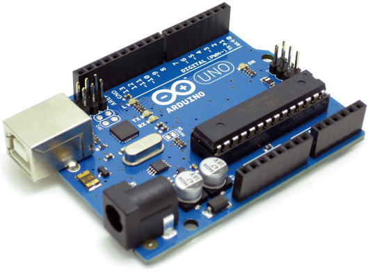

## Aprendiendo a usar Arduino

Siempre he tenido la curiosidad de saber como funcionaban las cosas, de pequeño desmontaba cualquier aparato electrónico solo por la curiosidad de saber que dispositivos hacían que las cosas funcionen como deberían funcionar. Con Arduino ahora hago lo mismo, pero en vez de desmontar cosas, monto cosas, creo cosas para conseguir el mismo fin.

Aquí podréis encontrar aquellos proyectos que vaya creando y documentando. Desde encender un led a utilizar todo tipo de dispositivos, sensores, pantallas etc.

